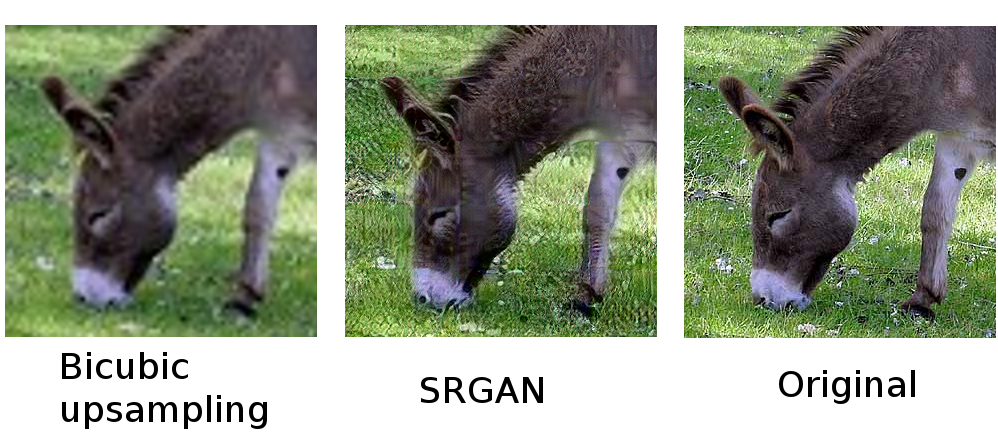
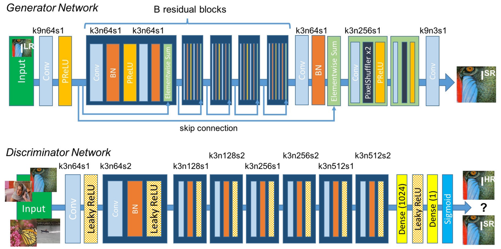

# SRGAN and SRResNet: Super-Resolution using GANs

This is a complete Pytorch implementation of [Christian Ledig et al: "Photo-Realistic Single Image Super-Resolution Using a Generative Adversarial Network"](https://arxiv.org/abs/1609.04802), 
reproducing their results. 
This paper's main result is that through using an adversarial and a content loss, a convolutional neural network is able to produce sharp, almost photo-realistic upsamplings of images. 

The implementation tries to be as faithful as possible to the original paper.
See [implementation details](#method-and-implementation-details) for a closer look. 
Pretrained checkpoints of SRResNet and SRGAN trained on the COCO dataset (118k images) are provided.



## Setup and Usage

### Prerequisites
- Get all dependencies using [Conda](https://conda.io): `conda env create -n srgan -f environment.yml`
- Activate the conda environment: `source activate srgan`
- Setup the folder structure and download the evaluation datasets: `./setup.sh`
- If you want to train a model yourself, you can download the MS COCO dataset: 
```
data/coco/download_coco.py --dest-path=resources/data/COCO
```
Warning: the dataset is 18GB in size and will take some time to download!

### Super-resolving an image using provided pretrained checkpoints

```
./eval.py -i configs/srresnet.json resources/pretrained/srresnet.pth path/to/image.jpg
./eval.py -i configs/srgan.json resources/pretrained/srgan.pth path/to/image.jpg
```
The super-resolved image will be saved to the same folder as the input image and named `image_pred.jpg`.

Note that the script uses GPU 0 by default. To use the CPU, pass `-c ''` as an additional flag to the script.

### Evaluating the provided pretrained checkpoints

To reproduce the [score evaluations](#quantitative-results) of the benchmark datasets:
```
./eval.py configs/srresnet.json resources/pretrained/srresnet.pth Set5 Set14 BSDS500
./eval.py configs/srgan.json resources/pretrained/srgan.pth Set5 Set14 BSDS500
```
To also get the super-resolved images of the benchmark dataset, you can pass the infer flag `-i` to the script.

### Training

The following commands reproduce the pretrained checkpoints.
```
./train.py configs/srresnet.json
./train.py configs/srgan.json
```
Note that you need to download the COCO train set beforehand.

Alternatively, you can train on the 200 training images of the BSDS500 dataset:
```
./train.py --conf train_dataset=BSDS500 configs/srresnet.json
./train.py --conf train_dataset=BSDS500 configs/srgan.json
```

The SRGAN training initializes the network with the pretrained SRResNet. 
If you want to use your own pretrained network, you have to adapt `pretrained_weights` in the SRGAN configuration. 
If you want to train the SRGAN from scratch (likely leading to worse results), you can remove this line.

Some further configuration values you can tweak:
- `upscale_factor`: Upscaling factor the network is trained on
- `num_epochs`: Number of epochs the networks is trained
- `resnet.json`: Configuration of the super-resolution network
- `srgan_discriminator.json`: Configuration of the SRGAN discriminator network

## Method and Implementation Details

Architecture diagram of the super-resolution and discriminator networks by Ledig et al:



The implementation tries to stay as close as possible to the details given in the paper. 
As such, the pretrained SRResNet and SRGAN are also trained with 1e6 and 1e5 update steps. 
The high amount of update steps proved to be essential for performance, which pretty much monotonically increases with training time.

The only real difference is that Ledig et al train on ImageNet (350k images), and this implementation was trained on MS COCO (118k images). In practice, this implementation reaches around the same performance as reported in the paper. 

Some further implementation choices where the paper does not give any details:
- Initialization: orthogonal for the super-resolution network, randomly from a normal distribution with std=0.02 for the discriminator network
- Padding: reflection padding (instead of the more commonly used zero padding)

## Results

All given results are taken at 4x scale.

### Quantitative results

PSNR and SSIM scores of this implementation compared against the values reported in the paper. 
The values of our SRResNet match pretty closely to the reported values, whereas our SRGAN falls of a bit. 
This could be because of many things, as GAN training is rather unstable and can vary a lot even based on just random initialization.

| Dataset | Bicubic        | SRResnet (Ledig et al) | SRResNet (ours) | SRGAN (Ledig et al) | SRGAN (ours)   |
| ------- | -------------- | ---------------------- | --------------- | ------------------- | -------------- |
| Set5    | 28.43 / 0.8211 | 32.05 / 0.9019         | 31.94 / 0.8959  | 29.40 / 0.8472      | 28.78 / 0.8343 |
| Set14   | 25.99 / 0.7486 | 28.49 / 0.8184         | 28.55 / 0.7881  | 26.02 / 0.7397      | 25.53 / 0.6856 |
| BSDS100 | 25.94 / 0.6935 | 27.58 / 0.7620         | 27.55 / 0.7445  | 25.16 / 0.6688      | 24.17 / 0.6236 |
